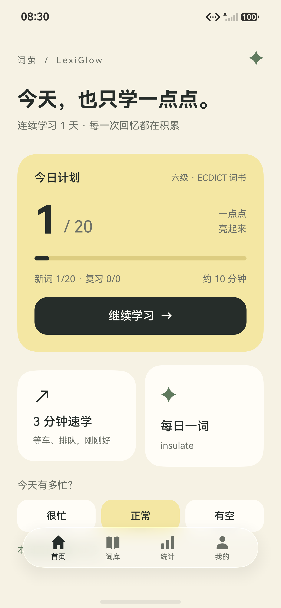
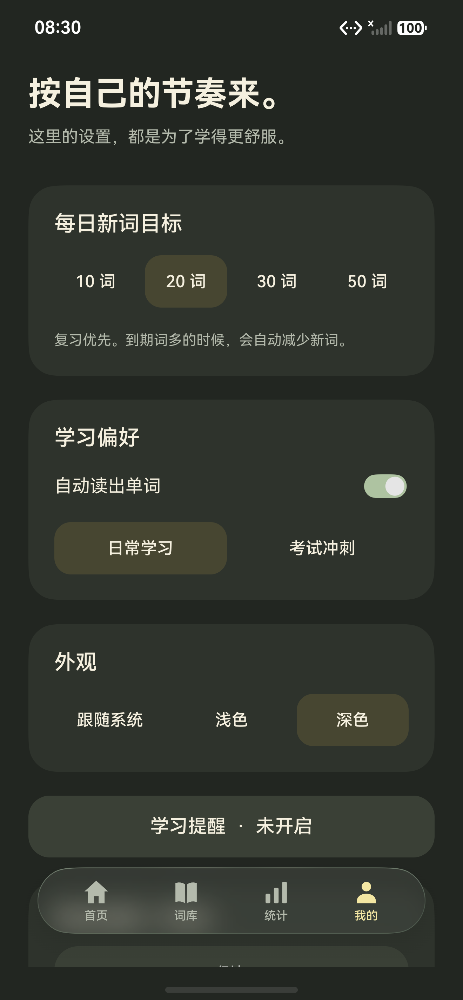

# 词萤 · LexiGlow

> **让单词一点一点亮起来。**

词萤是一款运行在 **HarmonyOS**（API 26）上的英语单词记忆应用，专为中国英语学习者设计。它以间隔重复算法为核心，通过「今天只需几分钟」的轻量互动，帮助用户在每天碎片时间里稳定扩大词汇量。

---

## 截图

<p align="center">
  
  &nbsp;&nbsp;
  
</p>

---

## 功能亮点

### 📚 五大内置词书（共 26,071 词条 · 10,689 个不同词头）

| 词书 | 词条数 |
|------|-------:|
| 四级 · ECDICT 词书 | 3,849 |
| 六级 · ECDICT 词书 | 5,407 |
| 考研 · ECDICT 词书 | 4,801 |
| 雅思 · ECDICT 词书 | 5,040 |
| 托福 · ECDICT 词书 | 6,974 |

词书数据来源于 [ECDICT](https://github.com/skywind3000/ECDICT)（MIT 许可），完整离线可用，无需登录与网络。同一词头在不同词书间共享学习进度，不会重复计算。

### 🔁 间隔重复算法

三档自评判断（**不认识 / 模糊 / 认识**）严格采用产品方案第 13 节的 V1 调度：

| 判断 | 强度变化 | 下次间隔 |
|------|----------|----------|
| 不认识 | −20 | 10 分钟（回到 L0）/ 12 小时 |
| 模糊 | +5，上限 100，等级不变 | 当前基础间隔 × 0.6 |
| 认识 | +12，上限 100，升一级 | 下一等级基础间隔：1 → 3 → 7 → 14 → 30 → 60 天 |

记忆状态采用方案第 8.2 节的累计强度区间：0–24 陌生、25–49 模糊、50–74 熟悉、75–100 掌握。首次选择“认识”从 0 增到 12；连续认识 5 次达到 60（熟悉），7 次达到 84（掌握）。升级时按完整的历史判断记录撤回旧版强度保底值，保留已保存的复习时间和学习进度。

复习积压超 60 词时自动减少新词，超 100 词时暂停新词——避免越学越欠。

### ⚡ 动态每日计划

- **「今天有多忙？」** 首页临时选择 *很忙（5 分钟）/ 正常（10–15 分钟）/ 有空（20+ 分钟）*，只影响当天预算，不改动长期目标。
- **考试倒计时** 可设置四六级/考研等考试日期，首页显示剩余天数与冲刺建议。
- 跨本地午夜自动生成新日期计划，长期进度不清零。
- 首页今日计划进度合计新词学习与复习任务，分列新词数和复习次数。两类目标均达标后才算计划完成；复习不会增加已学词库的去重词数，只复习的日期也计为活跃学习日。

### 中文释义挑战与已学单词

- 首页可开始一轮最多 10 词的中文释义挑战，题目仅从有学习记录的词中随机选取，轮内不重复。
- 写出词典中的任意一个完整中文义项即可通过，兼容词性、标点、括号说明和形容词的自然写法。答题后显示释义和本轮得分，练习独立计分。
- 词库页提供已学单词入口，按本地首次学习日期倒序分组，支持近期日期切换、系统日期选择器、当天英文/中文搜索和分页浏览。
- 复习不会移动首次学习日期；收藏但尚未学过的词不进入挑战或已学列表。当前词书的自定义释义优先展示。

### 🔊 英语语音朗读

使用 HarmonyOS Core Speech Kit（英语 Laura 音色，离线引擎），安装英语语音包后断网可用；未安装时显示提示，不阻断学习流程。

### 🪟 桌面卡片（Home Screen Widget）

提供两种 ArkTS 卡片：

| 卡片 | 尺寸 | 内容 |
|------|------|------|
| 每日一词 | 2×2 | 当日推荐单词及音标 |
| 今日计划 | 2×4 | 新词/复习进度、快捷入口 |

点击卡片可跳转至：单词详情、今日学习、到期复习、3 分钟速学。

### 📥 多格式词书导入与导出

**导入支持**：UTF-8 JSON、CSV（含 BOM、引号、多行例句）、TXT（多种分隔格式）、Word **DOCX**（含中文表格/正文行）。

**导出支持**：JSON（含完整学习进度，可再次导入）、CSV、TXT。

导入时仅有词头的词条将先匹配本地词典自动补全释义；未匹配项在导入预览中手动填写后再保存，不能跳过直接存入词书。

> 文件操作通过系统 DocumentViewPicker 完成，无需申请存储权限。

### 🔔 轻提醒

用户主动开启后才请求通知权限，每天定时发送一次代理提醒，修改时间自动替换，关闭后不再打扰。

---

## 技术架构

```
词萤 · LexiGlow
│
├── 平台：HarmonyOS API 26 / Stage 模型 / ArkTS
├── 构建：DevEco Studio + Hvigor
│
├── entry/src/main/ets/
│   ├── pages/              # 主页面（首页、词库、统计、我的）
│   ├── components/         # ImmersiveDock 沉浸悬浮底栏
│   ├── model/              # 数据模型（Word、WordProgress、DailyPlan …）
│   ├── repository/         # 数据访问层（DatabaseManager、LearningRepository）
│   ├── service/            # 业务逻辑
│   │   ├── ReviewScheduler  # 间隔重复纯函数调度器
│   │   ├── LearningService  # 学习会话管理
│   │   ├── AudioService     # TTS 发音
│   │   ├── DocxReader       # DOCX 安全解析
│   │   ├── TransferService  # 导入导出
│   │   ├── FormService      # 桌面卡片更新
│   │   └── ReminderService  # 代理提醒
│   ├── store/              # UserSettingsStore（Preferences 持久化）
│   ├── widget/pages/       # DailyWordCard、TodayPlanCard
│   └── utils/              # TimeUtils 等工具
│
├── entry/src/main/resources/rawfile/wordbooks/
│   └── catalog.json        # 五本词书 JSON（离线词库，版本 v2）
│
└── tools/
    ├── build_dictionary.py  # 从 ECDICT CSV 构建词库
    ├── verify_dictionary.py # 词库结构与内容校验
    └── test-platform.cjs    # 平台服务行为验证脚本
```

### 数据存储

| 数据类型 | 存储方式 |
|----------|----------|
| 词库、学习进度、复习记录 | HarmonyOS RDB（SQLite），`ciying.db` |
| 用户设置、当日计划 | Preferences（键值持久化） |
| 卡片快照 | Preferences（小型 JSON） |

每次学习判断将 `progress`、`review_record`、`daily_plan`、`daily_summary` 和 `study_session` 放在同一官方 `Transaction` 中原子提交；中途失败完整回滚，界面留在当前词便于重试。

### 视觉与沉浸体验

- **浅色主题**：页面、启动窗口和桌面卡片采用暖黄色背景 `#F6F2E4`，卡片恢复奶油色，学习计划及选中状态使用萤光黄。
- **沉浸光感（ImmersiveMaterial）**：启用 `ohos.arkui.UIMaterial.state`，Tabs 悬浮底栏使用原生 `ImmersiveMaterial`，栏高 56 vp，底部间距 8 vp，透明遮罩零高度。
- **渐进模糊标题栏**：四个主页使用 `Navigation BarStyle.STACK` + `ScrollEffectType.GRADUAL_BLUR`，滚动时大标题原生渐进消隐，切换为紧凑标题。
- **深色主题**：中性炭黑背景 + `#FFD45C` 主金黄色 + `#665000` 暖黄卡片，主文字对比度约 6.86:1。
- **无障碍**：支持字体放大、大屏/宽窗口布局，无硬编码全屏像素。
- **平板与 2in1 布局**：主页面顶部对齐，按实际内容宽度切换卡片列数；全屏扩展内容范围，等比例小窗收紧留白与间距。

---

## 数据隐私

- V1 **不需要登录**，所有学习数据保存在本机。
- 通知权限在用户主动开启提醒时才申请，首屏不弹权限请求。
- 文件读写通过系统选择器完成，应用只访问用户明确选定的文件。
- 核心背词功能**完全离线**可用；网络仅用于将来可选的 AI 功能（尚未实现）。

---

## 词库版权

内置词库数据来源：[skywind3000/ECDICT](https://github.com/skywind3000/ECDICT)，固定提交 `bc015ed`（2025-03-28），MIT 许可证。完整版权声明保存在 `entry/src/main/resources/rawfile/licenses/ECDICT-MIT.txt`。

应用图标 `ciying_icon.svg` 为原创矢量图形（暖黄背景 + 深灰折叠词卡 + 萤光点），不来自上游词典。

---

## 构建与开发

### 环境要求

- **DevEco Studio** 含 HarmonyOS API 26 Release SDK（`26.0.0.105`）
- **Node.js**（用于平台服务验证脚本）
- **Python 3**（用于词库构建与校验脚本）

### 构建 HAP

```sh
# 使用 Hvigor 命令行构建
hvigorw assembleHap --mode module -p module=entry@default -p product=default
```

### 运行平台服务验证

```sh
node tools/test-platform.cjs
```

验证 JSON / CSV / TXT 解析、DOCX ZIP 安全解压、词书导出格式往返、TTS 释放、代理提醒路径及桌面卡片配置。

### 构建/校验词库

```sh
# 从 ECDICT CSV 重新构建词库（需先下载 ecdict.csv）
python3 tools/build_dictionary.py /path/to/ecdict.csv

# 校验词库结构与内容完整性
python3 tools/verify_dictionary.py
```

### 真机测试

```sh
# 运行原生平台测试（DOCX / TXT / CSV 格式往返）
hdc shell aa test -b com.lovexjy.lexiglow -m entry_test \
  -s unittest OpenHarmonyTestRunner \
  -s class PlatformNativeTest -w 20
```

---

## 开发路线

| 阶段 | 状态 | 内容 |
|------|------|------|
| MVP | ✅ 已实现 | CET-4 词库、学习/复习闭环、间隔调度、RDB + Preferences、基础统计 |
| V1.0 | ✅ 已实现 | 五本词书、收藏/生词本、3 分钟速学、桌面卡片、深浅色、28 天统计日历、导入导出 |
| V1.5 | 🔜 计划中 | FSRS 算法升级、AI 例句/辨析、账号同步、自定义导入、考试冲刺模式 |

---

## 发布说明

当前版本为 **v1.0.0**（`versionCode: 1000000`），Bundle ID：`com.lovexjy.lexiglow`。

---

## 许可

本项目源代码版权归作者所有。内置词库数据遵循 [MIT License（ECDICT）](entry/src/main/resources/rawfile/licenses/ECDICT-MIT.txt)。

---

## 联系

如有问题或建议，欢迎发邮件至：[peryixing@Gmail.com](mailto:peryixing@Gmail.com)
